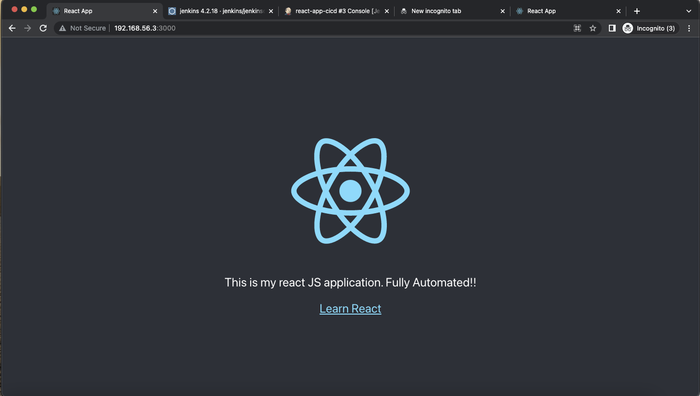
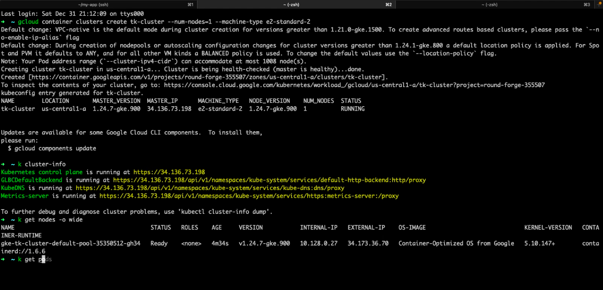
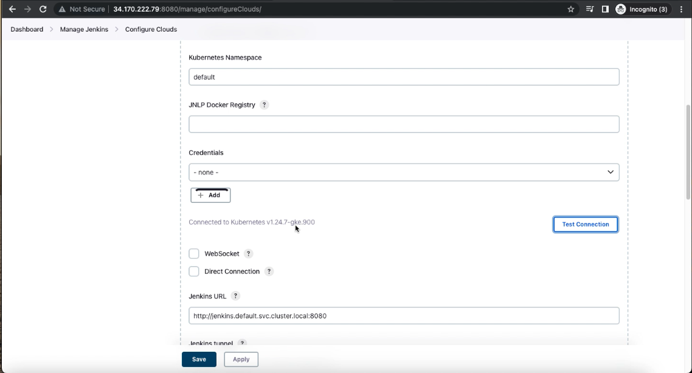

## Dockerizing the React Application:

- Firstly, I created the react js application.
- Then wrote the Dockerfile to build the docker image.

```
FROM node:14-alpine
ENV NODE_ENV development
WORKDIR /app
COPY package.json .
RUN yarn install
COPY . .
EXPOSE 3000
CMD [ "yarn", "start"]

```

- Then built the image using docker build -t react-app:v1
- Then tried to run the application on to the docker host.



- We can see from the above screenshot that application is working fine on our local machine.
  

  ## Making the kubernetes cluster on GKE:

  - I used GCP to create the kubernetes cluster.
  
  

  - Installed Jenkins on this kubernetes Cluster using Helm Charts and also configured the Kuberntes pod as dynamic jenkins agent. So that our CICD pipeline can run on the jenkins dynamic pods and after the pipeline is completed the pod will be terminated.
  

  ```
        pipeline {
        agent {
            kubernetes {
            yaml '''
                apiVersion: v1
                kind: Pod
                metadata:
                labels:
                    app: test
                spec:
                containers:
                - name: git
                    image: bitnami/git:latest
                    command:
                    - cat
                    tty: true
                - name: kubectl-helm-cli
                    image: kunchalavikram/kubectl_helm_cli:latest
                    command:
                    - cat
                    tty: true
                - name: kaniko
                    image: gcr.io/kaniko-project/executor:debug
                    command:
                    - cat
                    tty: true
                    volumeMounts:
                    - name: kaniko-secret
                    mountPath: /kaniko/.docker
                volumes:
                - name: kaniko-secret
                    secret:
                    secretName: regcred
                    items:
                        - key: .dockerconfigjson
                        path: config.json
            '''
            }      
        }
        environment{
            DOCKERHUB_USERNAME = "tarunk0"
            APP_NAME = "react-webapp"
            IMAGE_NAME = "${DOCKERHUB_USERNAME}" + "/" + "${APP_NAME}"
            IMAGE_TAG = "${BUILD_NUMBER}"
            PROJECT_ID = 'round-forge-355507'
            CLUSTER_NAME = 'tk-cluster'
            LOCATION = 'us-central1-a'
            CREDENTIALS_ID = 'gke'	
        }
        stages {
            stage('Checkout SCM') {
            steps {
                container('git') {
                git url: 'https://github.com/tarunk0/my-app.git',
                branch: 'main'
                }
            }
            }
        
        stage('Build and push Container Image'){
            steps {
            container('kaniko'){
                sh "/kaniko/executor --context $WORKSPACE --destination $IMAGE_NAME:$IMAGE_TAG --destination $IMAGE_NAME:latest"
            }
            }
        }   
        stage('Deploy to K8s') {
                    steps{
                    container('kubectl-helm-cli') {
                        echo "Deployment started ..."
                        sh 'ls -ltr'
                        sh 'pwd'
                        sh "sed -i 's/tagversion/${env.BUILD_ID}/g' service.yaml"
                        sh "sed -i 's/tagversion/${env.BUILD_ID}/g' deployment.yaml"
                        echo "Starting deployment of service.yaml"
                        step([$class: 'KubernetesEngineBuilder', projectId: env.PROJECT_ID, clusterName: env.CLUSTER_NAME, location: env.LOCATION, manifestPattern: 'service.yaml', credentialsId: env.CREDENTIALS_ID, verifyDeployments: true])
                        echo "Starting deployment of deployment.yaml"
                        step([$class: 'KubernetesEngineBuilder', projectId: env.PROJECT_ID, clusterName: env.CLUSTER_NAME, location: env.LOCATION, manifestPattern: 'deployment.yaml', credentialsId: env.CREDENTIALS_ID, verifyDeployments: true])
                        echo "Deployment Finished ..."
                    }
                    }
                }
            }
        }

```

- We can all the steps followed inside the Jenkins file in the above code.
- In the first part of the code we can see the kuberntes pods which has been configured to run every stage inside the respective containers. For Eg: We have Kaniko container for basically building and pushing the docker image to docker hub.
- In last step we can see that, The application is being deployed to the kubernetes cluster which is GKE and for doing that I have installed a plugin called GKE inside jenkins and using that Plugin We can deploy the application on to the cluster.
- We need Service Account's json key to basically authenticate ourselves with the cluster. I added the Credentials inside jenkins of type Private key from GCP by the name of GKE





